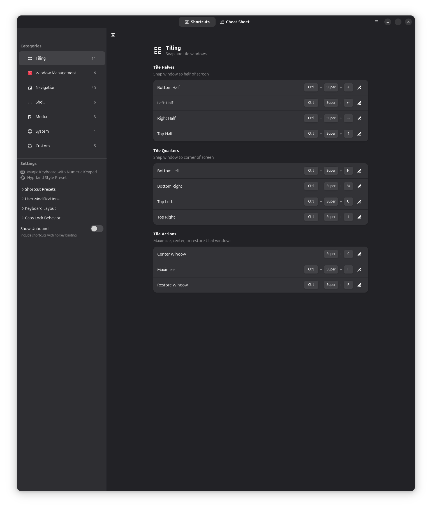
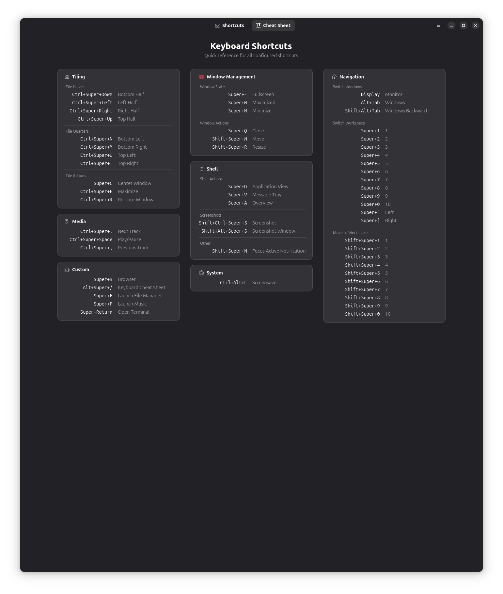
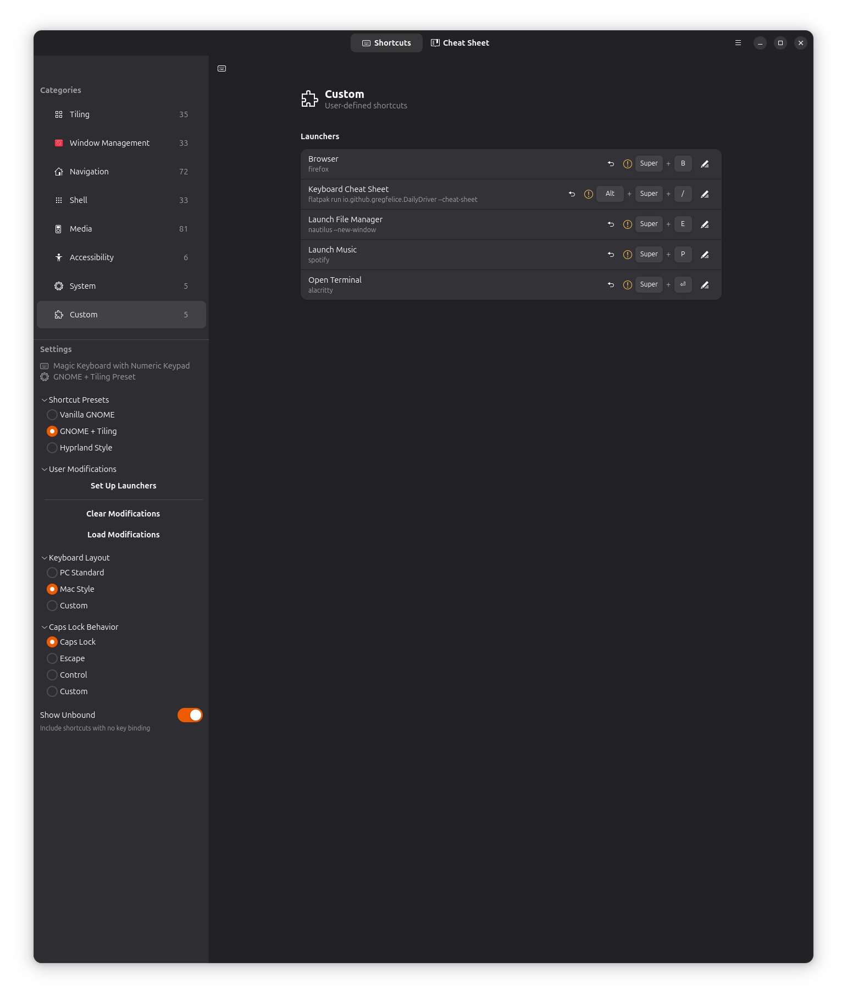

# DailyDriver

**Visual keyboard shortcut configuration for GNOME/Wayland**

[](https://github.com/gregfelice/dailydriver/actions/workflows/test.yml)
[](https://www.gnu.org/licenses/gpl-3.0)
[](https://github.com/gregfelice/dailydriver/releases)

DailyDriver lets you configure GNOME keyboard shortcuts visually, apply curated presets, and see all your shortcuts at a glance with a keyboard cheat sheet.



<details>
<summary>More screenshots</summary>

### Cheat Sheet
Quick reference overlay showing all active shortcuts (Alt+Super+/)



### Preset Selection
Choose from curated shortcut profiles



</details>

## Features

- **Preset Profiles** - One-click configuration with curated shortcut sets
- **Clean Slate Mode** - Presets disable ALL shortcuts first, then apply only what's defined (no mystery keymaps)
- **Keyboard Cheat Sheet** - Quick reference overlay showing all active shortcuts (Alt+Super+/)
- **10 Workspace Support** - Navigate workspaces with Super+1-9, Super+0
- **Visual Keyboard** - See shortcuts on an interactive keyboard layout
- **Conflict Detection** - Warns when shortcuts conflict with existing bindings
- **Tiling Assistant Integration** - Built-in support for tiling shortcuts

## Installation

### Alpha Release (Current)

Download the Flatpak bundle from [Releases](https://github.com/gregfelice/dailydriver/releases):

```bash
# Download dailydriver-0.1.0-alpha.flatpak from releases, then:
flatpak install dailydriver-0.1.0-alpha.flatpak

# Run
flatpak run io.github.gregfelice.DailyDriver

# Cheat sheet mode (popup overlay)
flatpak run io.github.gregfelice.DailyDriver --cheat-sheet
```

### From Source

```bash
git clone https://github.com/gregfelice/dailydriver.git
cd dailydriver
./run-dev.sh
```

## Platform Support

| Platform | Version | Status |
|----------|---------|--------|
| GNOME on Wayland | 45, 46, 47 | Tested in CI |
| GNOME on X11 | 45+ | Should work (untested) |
| KDE Plasma | - | Planned |
| Hyprland | - | Planned |

### Requirements

- GNOME 45+
- Wayland session (recommended)
- Flatpak runtime: `org.gnome.Platform//47`

## Built-in Presets

| Preset | Description |
|--------|-------------|
| **Hyprland Style** | Keyboard-centric workflow with vim-like navigation. Super+Q close, Super+hjkl tiling, Super+1-0 workspaces. |
| **GNOME + Tiling** | Standard GNOME with Tiling Assistant snap zones. Alt+F4 close, Super+arrows for tiling. |
| **Vanilla GNOME** | Pure GNOME Shell defaults without tiling extensions. |
| **Minimal** | Clean slate with only essential shortcuts enabled. |

## How It Works

When you apply a preset, DailyDriver:

1. **Disables ALL shortcuts** - Clears every GNOME keybinding to start fresh
2. **Applies only what's defined** - Sets exactly the shortcuts in your preset file
3. **Preserves custom launchers** - Your Terminal/Browser/Files shortcuts stay intact

This "clean slate" approach means your cheat sheet shows exactly what's in your config - no inherited GNOME defaults cluttering things up.

## Development

```bash
# Run tests
pytest tests/ -v

# Lint
ruff check src/ tests/
ruff format src/ tests/

# Build Flatpak locally
flatpak-builder --force-clean --user --install build-dir io.github.gregfelice.DailyDriver.yml
```

## CI/CD

Tests run on every push:
- **Lint** - ruff check and format
- **Unit Tests** - pytest with coverage
- **Integration Tests** - Real GNOME Shell on Fedora 39/40/41 (GNOME 45/46/47)
- **Preset Validation** - Ensures all preset TOML files are valid
- **Flatpak Build** - Verifies the app builds as a Flatpak

## Roadmap

- [x] Screenshots for README
- [ ] Flathub submission
- [ ] KDE Plasma backend
- [ ] Hyprland backend
- [ ] Custom shortcut editor (create new shortcuts)
- [ ] Import/export profiles

## Feedback & Contributing

This is alpha software - your feedback helps!

- **Bug reports**: [Open an issue](https://github.com/gregfelice/dailydriver/issues/new?labels=bug&title=Bug:%20)
- **Feature requests**: [Open an issue](https://github.com/gregfelice/dailydriver/issues/new?labels=enhancement&title=Feature:%20)
- **Questions**: [Open an issue](https://github.com/gregfelice/dailydriver/issues/new?labels=question&title=Question:%20)

## License

GPL-3.0-or-later
