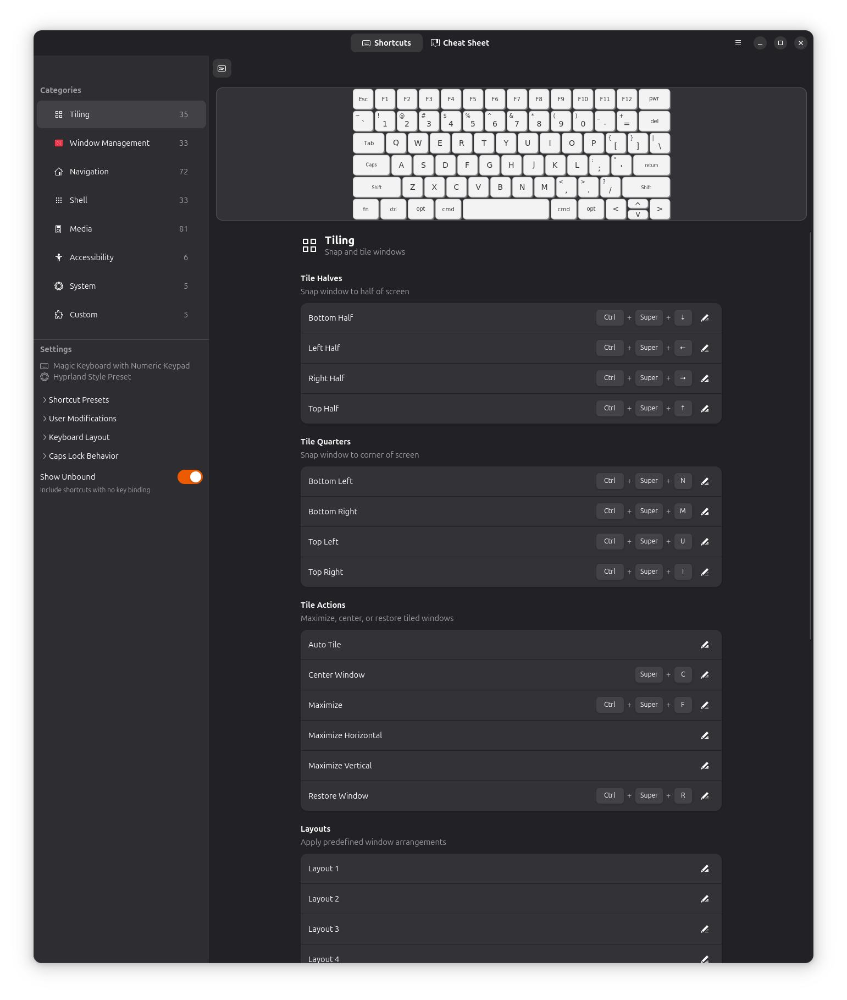
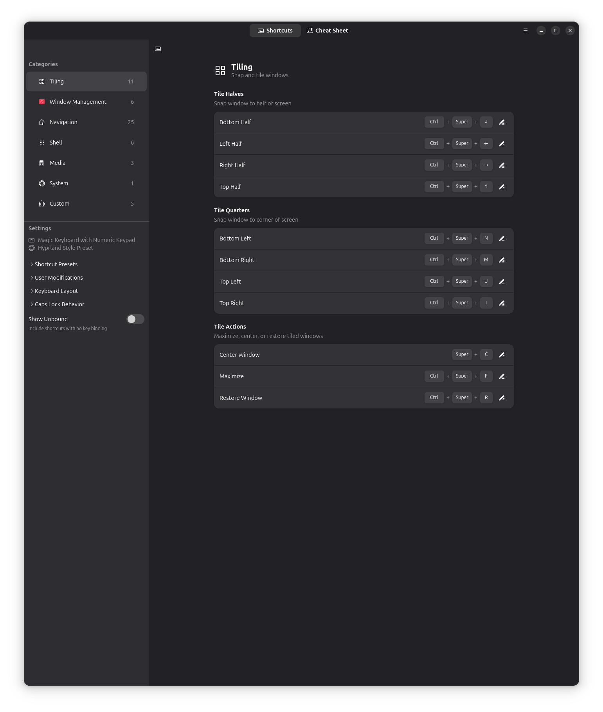
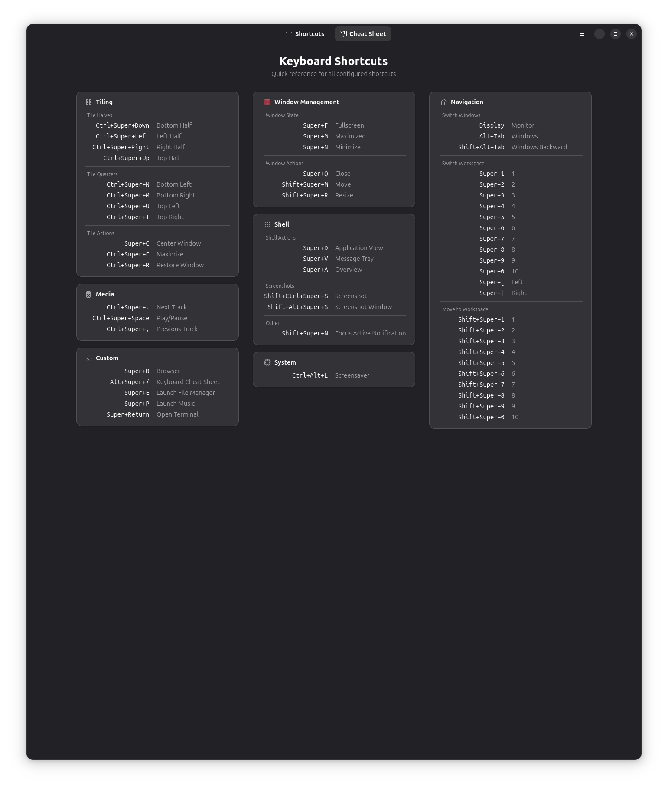
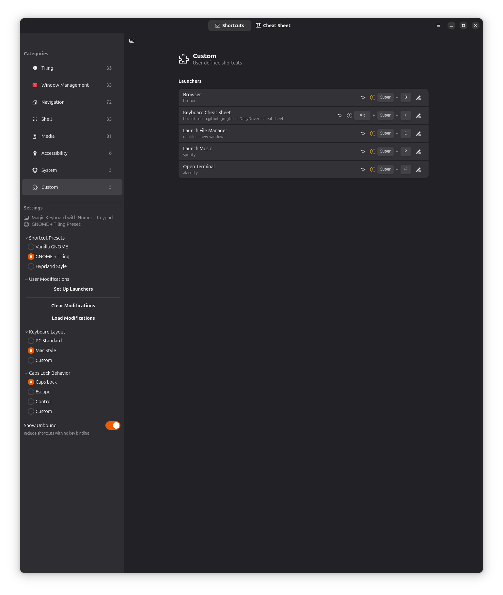

# Nightpanel

**Visual keyboard configuration + system-wide dark-mode orchestrator for GNOME/Wayland**

[](https://github.com/gregfelice/nightpanel/actions/workflows/test.yml)
[](https://www.gnu.org/licenses/gpl-3.0)
[](https://aur.archlinux.org/packages/nightpanel)

Nightpanel is two tools under one roof:

1. **Theming orchestrator** — one click flips alacritty, tmux, nvim, emacs, GNOME (GTK CSS + background), Claude Code, and Firefox into a coordinated dark palette. Toggle from a panel button or a CLI. Reverts to your pre-apply state on click.
2. **Keyboard configurator** (the original DailyDriver functionality) — visually edit GNOME keyboard shortcuts, apply curated presets (Hyprland-style, GNOME+Tiling, Vanilla), see everything on a cheat sheet overlay (Alt+Super+/).



<details>
<summary>More screenshots</summary>

### Shortcuts List

Browse and edit shortcuts by category



### Cheat Sheet

Quick reference overlay showing all active shortcuts (Alt+Super+/)



### Preset Selection

Choose from curated shortcut profiles



</details>

## Theming layer

The theming side is built around the **Adapter** contract — one Python class per tool that knows how to snapshot, apply, revert, and verify its piece of the palette. Adding a new tool is one class + one list append. Currently bundled:

| Tool | Mechanism |
|---|---|
| alacritty | Flips the `import` line in `alacritty.toml` to a rendered NP theme. |
| tmux | Sources a palette overlay; revert re-sources `~/.tmux.conf`. |
| nvim | Drops an `after/plugin/nightpanel_active.lua`; talks to live instances over `--server`. |
| emacs | Renders `nightpanel-theme.el`, drives daemons via `emacsclient`. |
| GNOME (GTK CSS + background) | Writes a sentinel-wrapped block into `~/.config/gtk-{3,4}.0/gtk.css`; swaps `color-scheme` + background color via `gsettings`. |
| Claude Code | Flips `theme` in `~/.claude/settings.json`; installs a `~/.local/bin/claude` wrapper that strips `COLORTERM` while NP is active. |
| Firefox | Installs a tiny extension + native-messaging host; CSS overrides via `tabs.insertCSS` with `cssOrigin: "user"`. **Opt-in** — bridge install requires explicit consent because it lowers `xpinstall.signatures.required`. |

Want to add an adapter for kitty / wezterm / ghostty / helix / chromium / your editor? See `src/nightpanel/adapters/base.py` for the contract and any of the existing adapters for shape. PRs welcome.

## Installation

### Arch Linux (AUR)

```bash
yay -S nightpanel
# or
paru -S nightpanel
```

Migrating from `dailydriver`?

```bash
sudo pacman -R dailydriver
yay -S nightpanel
```

### Debian / Ubuntu (apt)

Nightpanel can be published as a `.deb` to a [Forgejo Debian package registry](https://forgejo.org/docs/latest/user/packages/debian/) (or any apt repo). Register the repo once, then `install` / `update` / `upgrade` / `remove` it with plain apt. Fill in your own values:

- `FORGEJO_HOST` — your Forgejo host (e.g. `git.example.com`)
- `OWNER` — the user or org that owns the package registry
- `DIST` — the distribution you uploaded under (e.g. `trixie`)
- `TOKEN` — a Forgejo access token with `read:package` scope (only needed if the registry is private)

```bash
FORGEJO_HOST=git.example.com
OWNER=youruser
DIST=trixie
TOKEN=<your-forgejo-read-token>

# 1. signing key
sudo install -d -m 0755 /etc/apt/keyrings
curl -fsSL -u "$OWNER:$TOKEN" \
  "https://$FORGEJO_HOST/api/packages/$OWNER/debian/repository.key" \
  | sudo tee /etc/apt/keyrings/forgejo-nightpanel.asc >/dev/null

# 2. apt credentials (private registry only)
echo "machine $FORGEJO_HOST/api/packages/$OWNER/debian login $OWNER password $TOKEN" \
  | sudo tee /etc/apt/auth.conf.d/forgejo-nightpanel.conf >/dev/null
sudo chmod 600 /etc/apt/auth.conf.d/forgejo-nightpanel.conf

# 3. apt source
echo "deb [signed-by=/etc/apt/keyrings/forgejo-nightpanel.asc] https://$FORGEJO_HOST/api/packages/$OWNER/debian $DIST main" \
  | sudo tee /etc/apt/sources.list.d/nightpanel.list >/dev/null

# 4. install
sudo apt update
sudo apt install nightpanel
```

Then the usual lifecycle:

```bash
sudo apt update && sudo apt upgrade   # new builds are picked up automatically
sudo apt remove nightpanel            # reverts an active theme first, then removes cleanly
```

After installing, log out/in once so GNOME Shell loads the panel-button extension, then `gnome-extensions enable nightpanel@nightpanel`.

### From Source

```bash
git clone https://github.com/gregfelice/nightpanel.git
cd nightpanel
meson setup build
meson compile -C build
meson install -C build
```

### Dev mode (no install)

```bash
./run-dev.sh        # config UI
nightpanel-toggle   # engage/disengage theming
```

## Platform Support

| Platform         | Status                 |
| ---------------- | ---------------------- |
| GNOME on Wayland | Primary target |
| GNOME on X11     | Should work (untested) |
| KDE Plasma       | Planned (adapter shape exists) |
| Hyprland         | Planned |

### Requirements

- Python 3.11+
- GTK 4, libadwaita 1
- GNOME 45+ (for the panel-button extension)

## Built-in Presets (keyboard layer)

| Preset | Description |
|---|---|
| **Hyprland Style** | Keyboard-centric: Super+Q close, Super+hjkl tiling, Super+1-0 workspaces |
| **GNOME + Tiling** | Standard GNOME with Tiling Assistant snap zones |
| **Vanilla GNOME**  | Pure GNOME Shell defaults |

Presets use a "clean slate" model: every shortcut is cleared first, then only the ones in the preset TOML are applied. Your cheat sheet shows exactly what's in your config — no inherited defaults.

## How the theming toggle works

1. **Snapshot** — every adapter captures its pre-apply state into `~/.config/nightpanel/nightpanel-state.json`.
2. **Apply** — every adapter writes its part of the palette.
3. **Mark active** — touch `~/.config/nightpanel/nightpanel-active`. (Only if ≥1 adapter succeeded; nightpanel won't lie about being "on" if everything failed.)
4. **Revert** — read the snapshot, each adapter restores its pre-state, unlink the marker.

The state machine is defensive against partial failures, double-clicks, and the user manually deleting the marker file mid-cycle.

## Development

```bash
# Run tests
pytest tests/unit/ -v

# Lint
ruff check src/ tests/
ruff format src/ tests/
```

## Roadmap

- [x] AUR package (under `nightpanel` from 0.2.1)
- [ ] COPR (Fedora)
- [ ] More tier-1 adapters: kitty, wezterm, helix, chromium
- [ ] KDE Plasma backend
- [ ] Hyprland backend
- [ ] UI surfacing of per-adapter apply outcomes
- [ ] Concurrent-apply lock + finer test coverage of the adapter layer

## Feedback & Contributing

- **Bug reports**: [Open an issue](https://github.com/gregfelice/nightpanel/issues/new?labels=bug&title=Bug:%20)
- **Feature requests**: [Open an issue](https://github.com/gregfelice/nightpanel/issues/new?labels=enhancement&title=Feature:%20)
- **Questions**: [Open an issue](https://github.com/gregfelice/nightpanel/issues/new?labels=question&title=Question:%20)

## License

GPL-3.0-or-later
